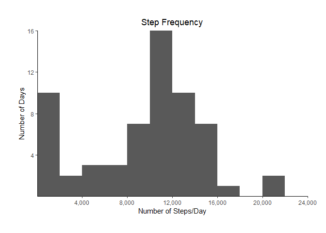
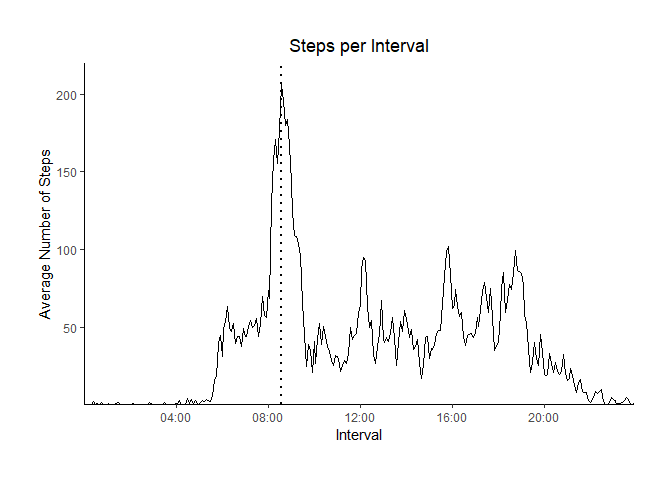
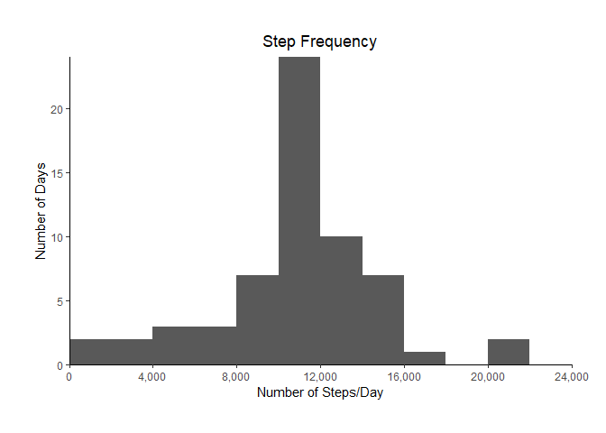
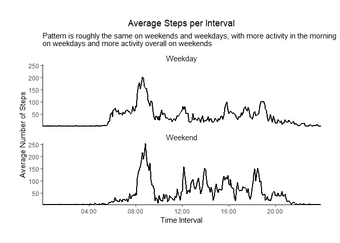

### Part 0: Set global options and load packages  


```r
options(scipen = 999,                           # Don't use scientific notation
        digits = 1)                             # Display one significant digit

knitr::opts_chunk$set(echo = TRUE, 
                      warning = FALSE,
                      message = FALSE,
                      fig.path = "./figure/")
```


```r
library(tidyverse)
library(scales)
library(lubridate)
library(chron)
```

### Part 1: Load and preprocess the data

Load data


```r
dataRead <- read.csv("./activity.csv")
```

Preprocess data: convert interval to time and combine with date to form a date/time object; convert date to a date object and time to a chron time object.


```r
data <-
    dataRead %>%
    mutate(time = paste(interval %/% 100,       # Convert time interval to time;
                        ":",                    # %/% is integer division, %% is
                        interval %% 100,        # modulus
                        ":00",
                        sep = ""),
           dateTime = ymd_hms(paste(date, " ", time)),
           date = ymd(date),
           time = times(time))
```

### Part 2: What is the mean total number of steps taken per day?


```r
# Group data by date and summarize
histData <-
    data %>%
    group_by(date) %>%
    summarize(totalSteps = sum(steps, na.rm = TRUE))

# Plot the data
ggplot(data = histData,
       mapping = aes(x = totalSteps)) +
    geom_histogram(breaks = seq(from = 0, to = 24000, by = 2000)) +
    labs(x = "Number of Steps/Day",
         y = "Number of Days",
         title = "Step Frequency") +
    scale_x_continuous(expand = c(0, 0),
                       breaks = seq(from = 4000, to = 24000, by = 4000),
                       label = scales::comma) +
    scale_y_continuous(expand = c(0, 0),
                       breaks = seq(from = 4, to = 16, by = 4)) +
    theme_classic() + 
    theme(plot.title = element_text(hjust = 0.5),
          plot.margin = margin(1, 1, 1, 1, "cm"))
```

<!-- -->

```r
# Calculate mean and median number of steps for display
meanSteps <- mean(histData$totalSteps, na.rm = TRUE)
medianSteps <- median(histData$totalSteps, na.rm = TRUE)
```

Histogram of the total number of steps taken each day with missing data (i.e.,`NA`s) ignored. Note that the `sum()` of an empty set is 0. As such, the sum of steps for days in which all measurements are `NA` is 0. These days--those in which all measurements are `NA`--contribute to the "spike" in the first bin.

Step statistics:  
mean: 9,354.2  
median: 10,395

### Part 3: What is the average daily activity pattern?


```r
# Group data by time and summarize
timeData <-
    data %>%
    group_by(time) %>%
    summarize(avgSteps = mean(steps, na.rm = TRUE))

# Find maximum time interval
maxInterval <- timeData[which.max(timeData$avgSteps), ][["time"]]

# Create x-axis breaks starting at 04:00 and labels without seconds (will also be used in Part 5)
breaks = seq(from = times("04:00:00"), to = times("20:00:00"), by = times("04:00:00"))
labels <- sub(":00$", "", as.character(breaks))

# Plot the data
ggplot(data = timeData, mapping = aes(x = time, y = avgSteps)) + 
    geom_line() +
    labs(x = "Interval",
         y = "Average Number of Steps",
         title = "Steps per Interval") +
    geom_vline(xintercept = maxInterval,
               linetype = "dotted",
               size = 1) +
    scale_x_chron(expand = c(0, 0),
                  breaks = breaks,
                  labels = labels) +
    scale_y_continuous(expand = c(0, 0), 
                       breaks = seq(from = 50, to = 220, by = 50),
                       limits = c(0, 220)) +
    theme_classic() + 
    theme(plot.title = element_text(hjust = 0.5),
          plot.margin = margin(1, 1, 1, 1, "cm"))
```

<!-- -->

Time series plot of the 5-minute intervals and the average number of steps taken, averaged across all days. Here, the interval with the maximum number of steps, 08:35, is marked by the dotted vertical line. 

### Part 4: Imputing missing values

`sum(!complete.cases(data))` = 2,304 rows in the data set have `NA`s.


```r
# Group by time and summarize
intervalAvg <-
    dataRead %>%
    group_by(interval) %>%
    summarize(intAvg = mean(steps, na.rm = TRUE))

# Overwrite steps field where steps is NA with the average number of steps for
# interval
data <-
    data %>%
    mutate(steps = ifelse(is.na(steps),
                          intervalAvg$intAvg[match(interval, intervalAvg$interval)],
                          steps))
```

As shown in the code chunk above, I imputed an `NA` by replacing it with the mean value of that interval.


```r
# Group by time and summarize
histData <-
    data %>%
    group_by(date) %>%
    summarize(totalSteps = sum(steps, na.rm = TRUE))

# Plot the data
ggplot(data = histData, mapping = aes(x = totalSteps)) +
    geom_histogram(breaks = seq(from = 0, to = 24000, by = 2000)) +
    labs(x = "Number of Steps/Day",
         y = "Number of Days",
         title = "Step Frequency") +
    scale_x_continuous(expand = c(0, 0),
                       breaks = seq(from = 0, to = 24000, by = 4000),
                       label = scales::comma) +
    scale_y_continuous(expand = c(0, 0)) +
    theme_classic() + 
    theme(plot.title = element_text(hjust = 0.5),
          plot.margin = margin(1, 1, 1, 1, "cm"))
```

<!-- -->

```r
# Calculate mean and median number of steps for display
meanSteps <- mean(histData$totalSteps)
medianSteps <- median(histData$totalSteps)
```

Histogram of the total number of steps taken each day with imputed data.

Step statistics:  
mean: 10,766.2  
median: 10,766.2

The value for the mean increased from Part 2. This makes sense given that the previous average is included in the calculation of the new average multiple times--the new average could be no less than the old average. For similar reasons, the median also increased. Note that the shape of the histogram has also changed, with the spike in the first bin no longer present and the bin with the (new) average number of daily steps--the 10,000 to 12,000 steps bin--increasing accordingly.

### Part 5: Are there differences in the activity pattern between weekdays and weekends?


```r
# Add day of week--weekday or weekend--designation; by default, a week starts on
# Monday (1) and ends on Sunday (7)
data <-
    data %>%
    mutate(dayOfWeek = as_factor(if_else(wday(dateTime) %in% 1:5,
                                         "Weekday",
                                         "Weekend"))) %>%
    group_by(time, dayOfWeek) %>%
    summarize(avgSteps = mean(steps), .groups = "keep")

# Plot the data using a panel plot with two rows
ggplot(data = data, mapping = aes(x = time, y = avgSteps)) + 
    facet_wrap(~ dayOfWeek, nrow = 2) + 
    geom_line(size = 1) +
    labs(x = "Time Interval",
         y = "Average Number of Steps",
         title = "Average Steps per Interval",
         subtitle = "Pattern is roughly the same on weekends and weekdays, with more activity in the morning\non weekdays and more activity overall on weekends",
         color = "Day of Week") +
    scale_x_chron(expand = c(0, 0),
                  breaks = breaks,              # Breaks and labels are the same
                  labels = labels) +            # as in Part 3 
    scale_y_continuous(expand = c(0, 0),
                       breaks = seq(50, 260, 50)) +
    theme_classic() + 
    theme(plot.title = element_text(hjust = 0.5),
          plot.margin = margin(1, 1, 1, 1, "cm"),
          legend.position = c(0.7, 0.8),
          strip.background = element_blank(),
          strip.placement = "outside",
          strip.text.x = element_text(size = 11))
```

<!-- -->

Plot of the average number of steps taken per time interval on weekdays and weekends. As noted, the pattern is roughly the same, with more activity in the morning on weekdays and more activity overall on weekends.
